# FitTrack — Context-Aware Mobile App (Thesis)

**Development of a Context-Aware Mobile Application for Personalized Fitness and Nutrition**

Bachelor's Thesis · Babeș-Bolyai University (UBB), Faculty of Mathematics and Computer Science  
**Author:** Bolchis Răzvan · **Supervisor:** Assoc. Prof. PhD. Zsigmond Imre

---

## Overview

This repository contains the **full source code and thesis materials** for **FitTrack**, a **cross-platform mobile application** developed as my **Bachelor's thesis** at **Babeș-Bolyai University (UBB), Romania**.

FitTrack brings together **workout planning**, **nutrition tracking**, **meal planning**, and **community-oriented motivation** in one coherent, authenticated experience. The app is built with **React Native** and **TypeScript**, uses **Firebase** for authentication and cloud data, and integrates **public fitness and nutrition REST APIs** (with offline/default fallbacks) so the product remains usable without proprietary datasets.

<p align="center">
  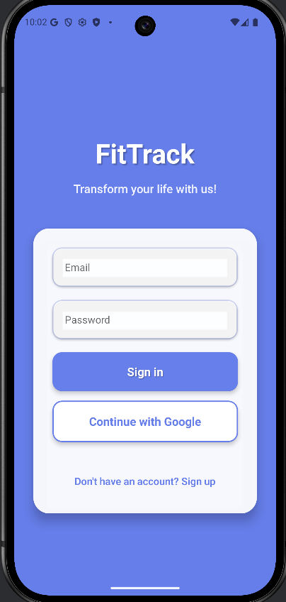
</p>

<p align="center"><em>Authentication and main dashboard hub</em></p>

---

## Technologies Used

| Area | Stack |
|------|--------|
| **Mobile** | React Native 0.79, React 19, TypeScript |
| **Navigation** | React Navigation (native stack) |
| **State** | React Context API, AsyncStorage |
| **Backend / cloud** | Firebase Authentication, Cloud Firestore, Firebase Storage |
| **Security** | Firestore Rules, Storage Rules |
| **Auth** | Email/password, Google Sign-In |
| **UI** | Theme system (light/dark), StyleSheet factories, Safe Area Context, Gesture Handler, Screens |
| **Graphics & media** | React Native SVG, Image Picker, Video, Share, RNFS |
| **Health (device)** | Google Fit / activity recognition (platform-dependent) |
| **Remote data** | Public REST APIs for exercise catalogs and food search; optional local API keys |
| **Android** | Gradle, Kotlin host (`MainActivity` / `MainApplication`), Google Services |
| **iOS** | Swift / Xcode RN host project (maintained in-repo) |
| **Tooling** | Metro, Babel, ESLint, Prettier, Jest, Node.js ≥ 18, Git |

**External integrations (client-side):** public exercise catalog APIs (primary + fallback), USDA FoodData Central, Open Food Facts, default offline food catalog, wger exercise database as fallback.

---

## Architecture

Application logic lives under `FitTrack/src/` (contexts, services, models, config, theme). UI screens are under `FitTrack/android/app/src/screens/` (React Native cross-platform UI). Entry point: `FitTrack/index.js` → `App.tsx` → `Navigation.tsx`.

<p align="center">
  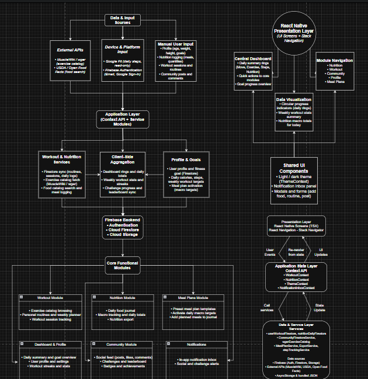
</p>

<p align="center">
  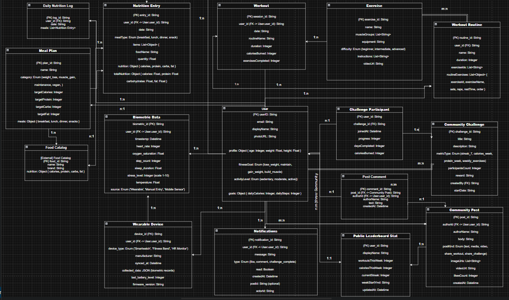
</p>

<p align="center"><em>High-level architecture · Firestore collections (ERD)</em></p>

---

## Features

### Dashboard & cross-module overview

- Consolidated **home surface** with daily stats (nutrition progress, workouts, sets, calories burned).
- **Quick actions** to Nutrition, Workout, Community, and Meal Plans.
- **Step indicators** via Google Fit where the platform grants activity permissions.

<p align="center">
  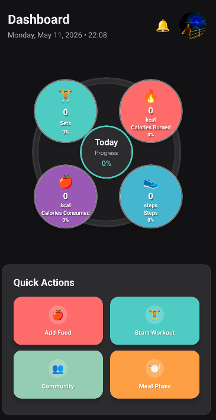
  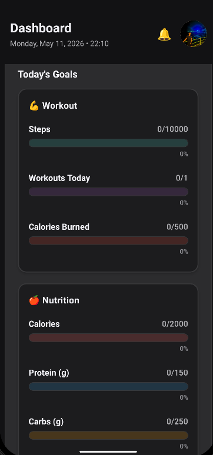
  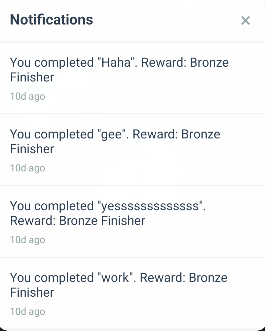
</p>

<p align="center"><em>Dashboard · Goals overview · In-app notifications</em></p>

---

### Workouts

- **Exercise discovery** through public REST exercise catalogs (optional API keys; wger fallback).
- **Interactive SVG muscle-group map** (front/back) to filter exercises by target area.
- **Preset and personal routines**, exercise detail views, and **guided session** tracking (sets, duration, calories).
- **Weekly workout planner** and **session history** synced to Firestore.

<p align="center">
  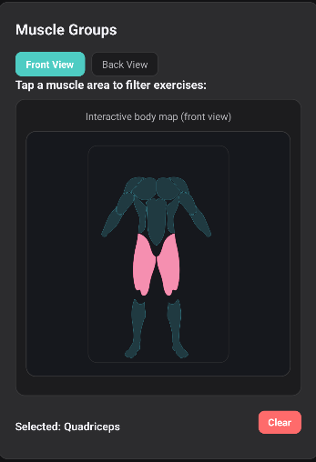
  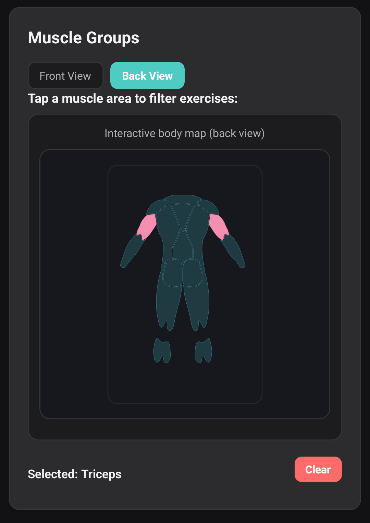
  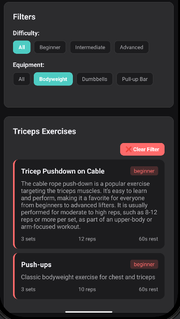
</p>

<p align="center"><em>Muscle map · Exercise catalog filtering</em></p>

<p align="center">
  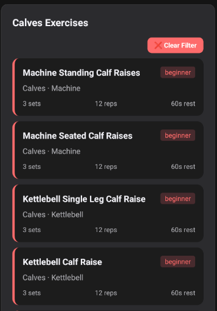
  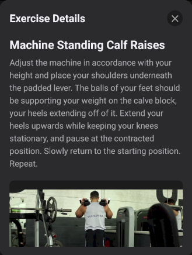
  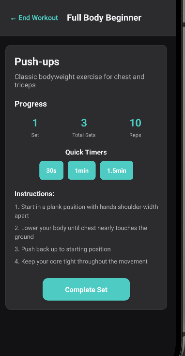
</p>

<p align="center"><em>Exercise list · Details · Guided session</em></p>

<p align="center">
  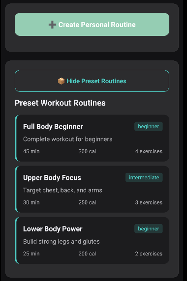
  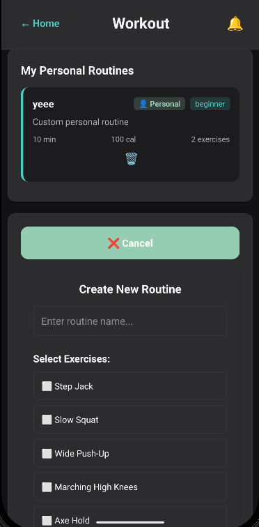
  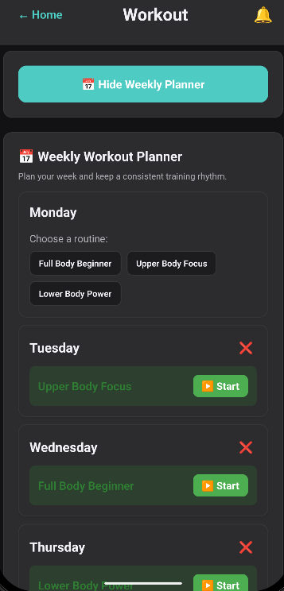
</p>

<p align="center"><em>Preset routines · Personal routines · Weekly planner</em></p>

<p align="center">
  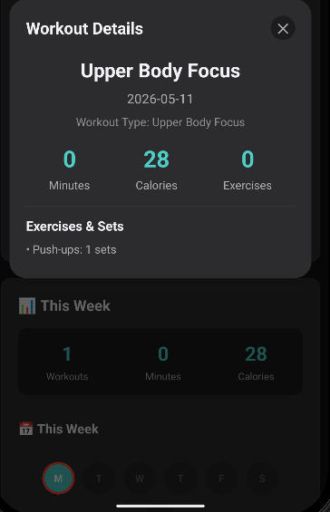
</p>

---

### Nutrition

- **Multi-source food search** (USDA, Open Food Facts, local default catalog).
- **Daily meal journal** with macro totals and progress toward daily goals.
- **Debounced sync** of daily logs to Firestore (`dailyNutritionLogs`).

<p align="center">
  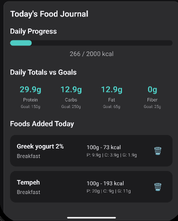
  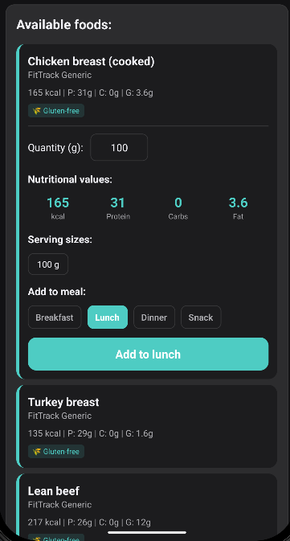
  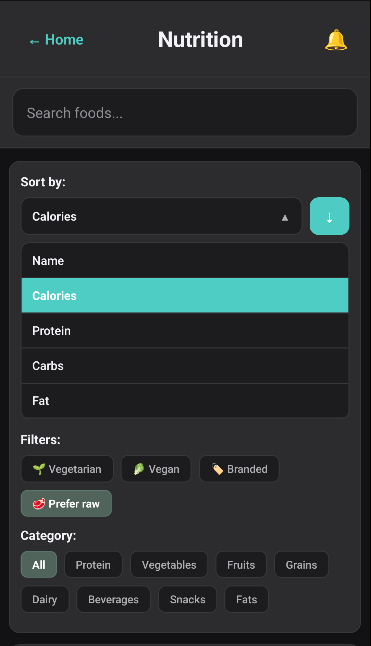
</p>

<p align="center"><em>Daily journal · Food logging · Sort and filter</em></p>

---

### Meal plans

- **Built-in meal templates** (local catalog) by goal (weight loss, muscle gain, vegan, etc.).
- **Meal plan details** with daily structure; activation applies **macro targets** to the nutrition module.

<p align="center">
  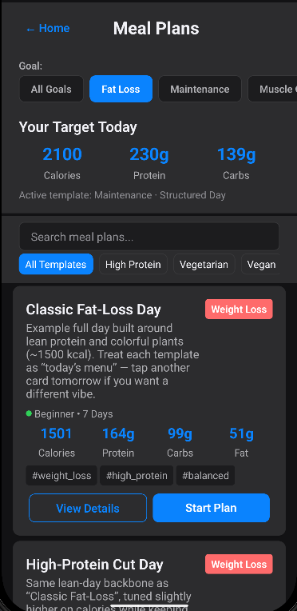
  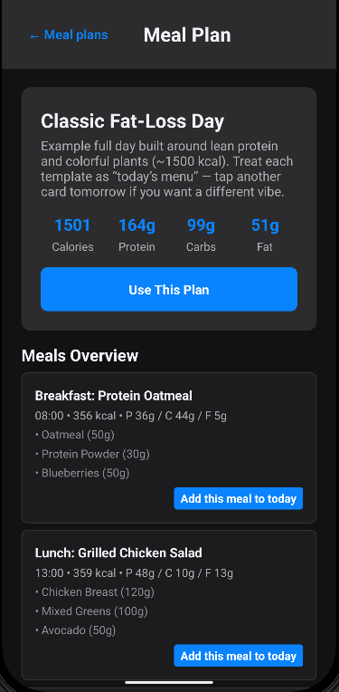
</p>

---

### Community

- **Social feed** (text, images, video, shared workouts/meals/challenges).
- **Challenges** with progress tracking and rewards.
- **Leaderboard**, **achievement badges**, and **in-app notification inbox**.

<p align="center">
  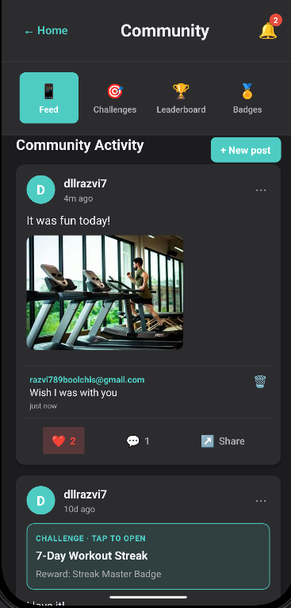
  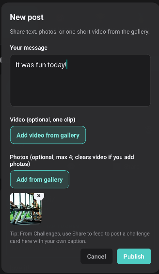
  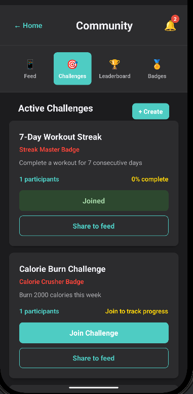
</p>

<p align="center"><em>Feed · Post detail · Challenges</em></p>

<p align="center">
  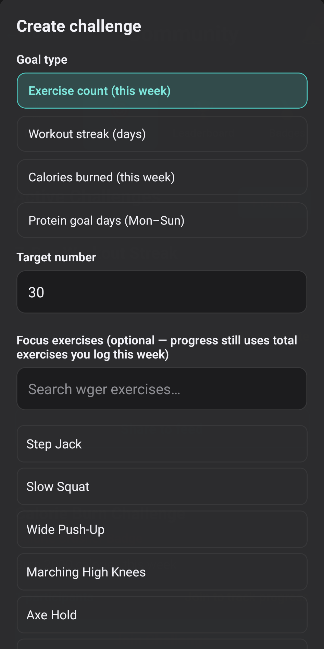
  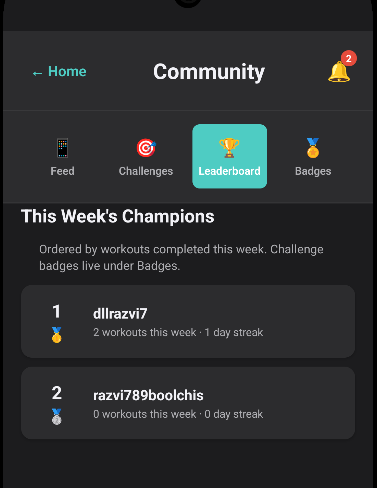
  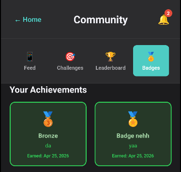
</p>

<p align="center"><em>Challenge sharing · Leaderboard · Badges</em></p>

---

### Profile & account

- User profile (Firestore), goals, avatar upload (Storage).
- **Light/dark theme**, workout/nutrition stats, **JSON data export** (share sheet).

<p align="center">
  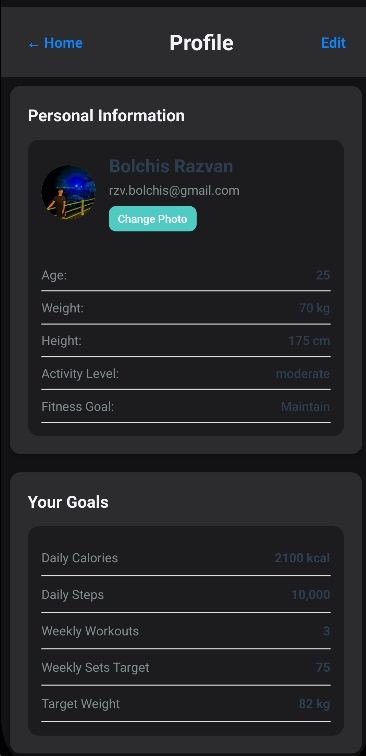
  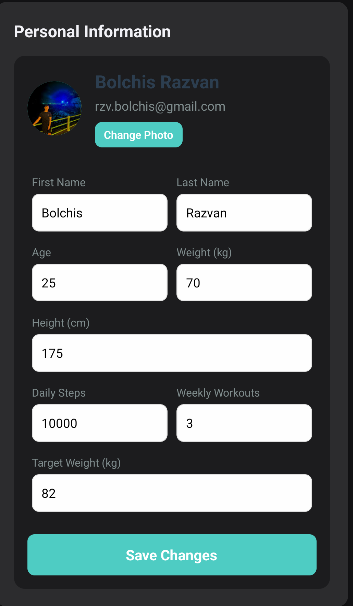
  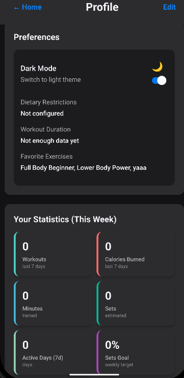
</p>

---

## Project structure

```text
FitTrack/                          ← repository root
├── FitTrack/                      ← React Native application
│   ├── android/
│   │   └── screenshots/           ← UI captures (linked above)
│   ├── ios/
│   ├── src/
│   │   ├── contexts/
│   │   ├── services/
│   │   ├── backend/models/
│   │   ├── config/
│   │   ├── theme/
│   │   └── utils/
│   ├── android/app/src/screens/
│   ├── App.tsx
│   ├── firestore.rules
│   ├── storage.rules
│   └── Bachelor_Thesis_Bolchis_Razvan.pdf
├── README.md
└── package.json                   ← delegates npm scripts to ./FitTrack
```

---

## Run locally

**Prerequisites:** [React Native environment setup](https://reactnative.dev/docs/set-up-your-environment), Node.js **≥ 18**, Android Studio (Android) and/or Xcode (iOS).

From the **repository root**:

```bash
npm install
npm start          # Metro — keep running in one terminal
npm run android    # or: npm run ios
```

Alternatively, from `FitTrack/`:

```bash
cd FitTrack
npm install
npm start
npm run android
```

### Configuration (not in public git)

| File | Location |
|------|----------|
| `google-services.json` | `FitTrack/android/app/` |
| `GoogleService-Info.plist` | iOS app target |
| `muscleWiki.local.ts` | copy from `FitTrack/src/config/muscleWiki.local.example.ts` |
| `usda.local.ts` | copy from `FitTrack/src/config/usda.local.example.ts` |

Without optional API keys, the app still runs using **wger** (exercises), the **default food catalog**, and **Open Food Facts** (branded search when enabled).

---

## Documentation

| Resource | Path |
|----------|------|
| **Thesis PDF** | [Bachelor_Thesis_Bolchis_Razvan.pdf](./FitTrack/Bachelor_Thesis_Bolchis_Razvan.pdf) |
| **Architecture diagram** | `FitTrack/android/screenshots/Arhitecture.png` |
| **Firestore ERD** | `FitTrack/android/screenshots/FitTrack_Firestore_ERD.png` |
| **Security rules** | `FitTrack/firestore.rules`, `FitTrack/storage.rules` |

---

## My role & scope

Individual thesis project. I owned:

- End-to-end **mobile implementation** (navigation, screens, UX flows, theme system).
- **Layered architecture**: Context API, service layer, typed models, Firestore persistence.
- **Firebase** wiring (Auth, Firestore, Storage) and **security rules**.
- **REST integration design** for exercise and food catalogs (fallbacks, debouncing, error handling).
- **Android-focused** build, permissions, and demo packaging.
- **Thesis writing** and repository documentation.

---

## What I learned

- Structuring a **multi-module React Native app** with shared state without screen silos.
- **Firebase** client patterns: auth-gated hydration, realtime listeners, denormalized leaderboard docs.
- **REST integration** in mobile: optional keys, partial failures, offline catalogs.
- **Platform constraints**: permissions, activity APIs, graceful UI degradation.
- Delivering a **portfolio-ready** repo: reproducible setup, accurate README, visual documentation.

---

## Author

**Bolchis Răzvan**  
Bachelor's Thesis, Computer Science — English Program  
Babeș-Bolyai University (UBB), Romania  
Supervisor: **Assoc. Prof. PhD. Zsigmond Imre**

**Repository:** [https://github.com/dllrazvi/FitTrack](https://github.com/dllrazvi/FitTrack)
